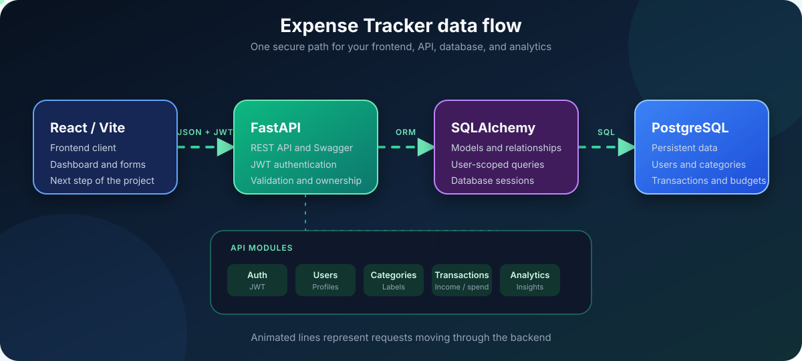

  <h1>Ledgerly Expense Tracker</h1>
  
A FastAPI and React workspace for personal income, expenses, budgets, debt, investments, and analytics.

  

    
    
    
  

  

    <a href="http://127.0.0.1:8000/docs">Open Swagger docs</a> |
    <a href="http://127.0.0.1:8000/health">Check API health</a>
  

  <table>
    <tr>
      <td><strong>Backend</strong> Ready for frontend integration</td>
      <td><strong>Interactive docs</strong> Swagger UI at <code>/docs</code></td>
      <td><strong>Tests</strong> 18 passing</td>
    </tr>
  </table>

## Architecture

  

The glowing lines animate request flow. The animation respects reduced-motion settings and the diagram remains readable as a static image.

  
Show the lightweight architecture fallback

~~~mermaid
flowchart LR
    Frontend[React or Vite frontend] -->|JSON and Bearer token| API[FastAPI API]
    API --> ORM[SQLAlchemy ORM]
    ORM --> DB[(PostgreSQL)]
~~~

The React/Vite frontend is now included in the `frontend/` folder. Swagger at `/docs` remains useful for API debugging and testing.

## Quick navigation

- [Start here](#start-here)
- [What works now](#what-works-now)
- [Run locally](#run-locally)
- [Run the frontend](#run-the-frontend)
- [Use the interactive API docs](#use-the-interactive-api-docs)
- [API endpoints](#api-endpoints)
- [Frontend integration](#frontend-integration)
- [Copy-ready examples](#copy-ready-examples)
- [Test the backend](#test-the-backend)
- [Database migrations](#database-migrations)
- [Security and production checklist](#security-and-production-checklist)
- [Security and safe sharing](docs/SECURITY.md)
- [Next steps](#next-steps)

## Start here

  
<strong>Run the API in three steps</strong>

1. Install the dependencies and copy <code>.env.example</code> to <code>.env</code>.
2. Create or update the database with <code>alembic upgrade head</code>.
3. Start the server with <code>uvicorn app.main:app --reload</code>, then open <a href="http://127.0.0.1:8000/docs">Swagger UI</a>.

Once authorized, create a category before adding a transaction. The transaction <code>category_id</code> must belong to the logged-in user.

## What works now

- JWT authentication with protected routes.
- Basic login throttling and logout-based access-token revocation.
- User registration and current-user lookup.
- React/Vite dashboard with login, registration, transactions, categories, budgets, and analytics.
- Lightweight CSS-first motion for buttons, lists, and the sign-in background; no animation library is shipped to users.
- Separate debt and investment tracking with debt direction and interest.
- Date presets and apply-on-demand filters keep the dashboard responsive.
- User-owned categories with duplicate-name protection.
- Transaction create, list, filter, update, and delete.
- Transaction filters for type, category, date range, and paginated responses with totals.
- One monthly budget per user and month.
- Budget spending, remaining limits, and available-after-plans calculations.
- Analytics for cash flow, debt, investments, and totals grouped by category.
- Exact money values up to 29 whole-number digits and 2 decimal places.
- Money response values are JSON strings so large amounts stay exact in JavaScript.
- Ownership checks so one user cannot read or change another user data.
- Request validation for email, password length, positive amounts, dates, and budget months.
- Local CORS support for a Vite or React frontend on port 5173.
- Automated API tests and GitHub Actions verification on pushes and pull requests.

## Project structure

~~~text
app/
|-- main.py                    App entry point, routers, CORS, logging, health check
|-- database.py                Database engine and session dependency
|-- model.py                   SQLAlchemy database models
|-- schemas.py                 Pydantic request and response schemas
|-- security.py                Password hashing and JWT authentication
|-- routes/
|   |-- users.py               Registration and current user
|   |-- auth.py                Login, throttling, and logout
|   |-- categories.py          Category CRUD
|   |-- transactions.py        Transaction CRUD and filters
|   |-- budgets.py             Monthly budget CRUD
|   |-- analytics.py           Summary and category analytics
migrations/
|-- env.py                     Alembic migration environment
|-- versions/                  Current schema and query-index revisions
|-- README.md                  Safe migration instructions
|-- 0002_add_finance_fields.sql  Legacy pre-Alembic record
`-- 0003_use_fixed_precision_money.sql  Legacy pre-Alembic record
frontend/
|-- package.json              React and Vite scripts
|-- package-lock.json         Locked frontend dependency tree
|-- vite.config.js            Vite configuration
|-- .env.example              Frontend API URL template
`-- src/
    |-- api.js                API client and token handling
    |-- App.jsx               Application state and panel orchestration
    |-- components/           Focused auth, budget, category, analytics, and transaction UI
    |-- utils.js              Shared date and exact-money helpers
    |-- main.jsx              React entry point
    `-- styles.css            Responsive application styles
tests/
|-- conftest.py                Isolated test database and test client
`-- test_api.py                API behavior tests
.env.example                  Safe environment variable template
pytest.ini                    Pytest configuration
alembic.ini                   Alembic configuration
docs/SECURITY.md              Secret rotation and safe-sharing guide
CONTRIBUTING.md               Commit and verification guide
requirements.txt              Runtime dependencies
requirements-dev.txt          Development and test dependencies
~~~

## Run locally

### Prerequisites

Install Python 3.12 or newer and PostgreSQL. Create a PostgreSQL database named `expense_tracker`, then put your local database password in `.env`.

These commands are for PowerShell.

~~~powershell
Set-Location "D:\class\Project\expense traker"
python -m venv .venv
.\.venv\Scripts\Activate.ps1
python -m pip install --upgrade pip
pip install -r requirements.txt
pip install -r requirements-dev.txt
Copy-Item .env.example .env
alembic upgrade head
uvicorn app.main:app --reload
~~~

If PowerShell blocks virtual-environment activation, run this once in the same PowerShell window:

~~~powershell
Set-ExecutionPolicy -Scope Process -ExecutionPolicy Bypass
~~~

Keep the terminal running while using the API. The server should show:

~~~text
Uvicorn running on http://127.0.0.1:8000
~~~

## Database migrations

For a new, empty database, run `alembic upgrade head` before starting the API. The application no longer creates tables automatically at startup.

If this project already has a development database from before Alembic was added, first back it up and read [migrations/README.md](migrations/README.md). Do not run the initial migration against existing tables. After confirming that its schema already contains the current finance fields, stamp it at `20260905_01` and then run `alembic upgrade head` to add dashboard indexes and align the transaction description field.

Open these pages in your browser:

- [API home](http://127.0.0.1:8000/)
- [Interactive Swagger docs](http://127.0.0.1:8000/docs)
- [OpenAPI JSON](http://127.0.0.1:8000/openapi.json)
- [Health check](http://127.0.0.1:8000/health)

## Run the frontend

Keep the FastAPI terminal running, then open a second PowerShell terminal:

~~~powershell
Set-Location "D:\class\Project\expense traker\frontend"
npm.cmd install
Copy-Item .env.example .env
npm.cmd run dev
~~~

Open http://localhost:5173. The frontend reads <code>VITE_API_URL</code> from <code>frontend/.env</code> and defaults to <code>http://127.0.0.1:8000</code>.

This environment uses <code>npm.cmd</code> because PowerShell may block the <code>npm.ps1</code> script. If regular <code>npm</code> works on your machine, it is also fine.

## Use the interactive API docs

Swagger is the easiest way to test the backend without writing frontend code.

1. Open http://127.0.0.1:8000/docs.
2. Open `POST /users/`, click **Try it out**, and register a user.
3. Open `POST /auth/login`, enter the same email in the `username` field, enter the password, and execute.
4. Copy the `access_token` from the response.
5. Click **Authorize** at the top of the page.
6. Enter the token in the value field and authorize.
7. Test the locked categories, transactions, budgets, and analytics endpoints.

The login endpoint uses the OAuth2 form field name `username` for Swagger compatibility. The value should still be your email address.

Suggested test order:

~~~text
POST /users/                  Register
POST /auth/login              Login and copy token
POST /auth/logout             Revoke the current token when finished
GET  /users/me                 Confirm authentication
POST /categories/             Create a category
POST /transactions/            Add income or expense
POST /budgets/                Add a monthly budget
GET  /analytics/summary       See totals
GET  /analytics/by-category   See category totals
~~~

## API endpoints

All endpoints marked with a lock require a Bearer token.

| Area | Method | Path | Purpose | Auth |
| --- | --- | --- | --- | --- |
| System | GET | `/` | Confirm the API is running | No |
| System | GET | `/health` | Health check | No |
| Users | POST | `/users/` | Register a user | No |
| Users | GET | `/users/me` | Get the logged-in user | Yes |
| Auth | POST | `/auth/login` | Log in and receive a JWT | No |
| Auth | POST | `/auth/logout` | Revoke the current JWT | Yes |
| Categories | GET | `/categories/` | List your categories | Yes |
| Categories | POST | `/categories/` | Create a category | Yes |
| Categories | GET | `/categories/{category_id}` | Get one category | Yes |
| Categories | PUT | `/categories/{category_id}` | Rename a category | Yes |
| Categories | DELETE | `/categories/{category_id}` | Delete an unused category | Yes |
| Transactions | GET | `/transactions/` | List and filter transactions | Yes |
| Transactions | POST | `/transactions/` | Create a transaction | Yes |
| Transactions | GET | `/transactions/{transaction_id}` | Get one transaction | Yes |
| Transactions | PUT | `/transactions/{transaction_id}` | Update a transaction | Yes |
| Transactions | DELETE | `/transactions/{transaction_id}` | Delete a transaction | Yes |
| Budgets | GET | `/budgets/` | List monthly budgets | Yes |
| Budgets | POST | `/budgets/` | Create a monthly budget | Yes |
| Budgets | GET | `/budgets/{budget_id}` | Get one budget | Yes |
| Budgets | PUT | `/budgets/{budget_id}` | Update a budget | Yes |
| Budgets | DELETE | `/budgets/{budget_id}` | Delete a budget | Yes |
| Analytics | GET | `/analytics/summary` | Cash, budget, debt, and investment totals | Yes |
| Analytics | GET | `/analytics/by-category` | Totals grouped by category | Yes |

## Frontend integration

The included dashboard uses this same API contract. This small JavaScript example shows the pattern for additional frontend screens:

~~~javascript
const API_URL = "http://127.0.0.1:8000";

const response = await fetch(API_URL + "/transactions/", {
  headers: {
    Authorization: "Bearer " + accessToken
  }
});

const page = await response.json();
const transactions = page.items;
const totalTransactions = page.total;
~~~

The login request is form-encoded because it follows the OAuth2 password flow:

~~~javascript
const loginBody = new URLSearchParams({
  username: email,
  password: password
});

const response = await fetch(API_URL + "/auth/login", {
  method: "POST",
  headers: {
    "Content-Type": "application/x-www-form-urlencoded"
  },
  body: loginBody
});
~~~

Local CORS currently allows <code>http://localhost:5173</code> and <code>http://127.0.0.1:5173</code>.

## Copy-ready examples

### Register

~~~json
{
  "name": "Sapna",
  "email": "sapna@example.com",
  "password": "strongpassword123"
}
~~~

### Create a category

~~~json
{
  "name": "Food"
}
~~~

Use the returned category `id` when creating a transaction. Do not assume that Food is category ID 1; IDs depend on the database.

### Create a transaction

~~~json
{
  "category_id": 5,
  "amount": 250,
  "type": "expense",
  "description": "Lunch",
  "date": "2026-08-29T12:00:00"
}
~~~

`category_id` must belong to the logged-in user. `amount` must be greater than zero and supports up to 29 whole-number digits with up to 2 decimal places. `type` can be `income`, `expense`, `debt`, or `investment`.
Money values returned by the API are strings such as `"250.00"`; this prevents large values from being rounded by JavaScript.

### Debt transaction

~~~json
{
  "category_id": 5,
  "amount": 5000,
  "type": "debt",
  "debt_direction": "borrowed",
  "interest_amount": 250,
  "description": "Personal loan",
  "date": "2026-08-29T12:00:00"
}
~~~

Use `debt_direction` as `borrowed` or `lent`. Debt is tracked separately from the normal income-expense balance. `interest_amount` is optional and is reported separately.

### Investment transaction

~~~json
{
  "category_id": 5,
  "amount": 1500,
  "type": "investment",
  "investment_action": "contribution",
  "description": "Index fund contribution",
  "date": "2026-08-29T12:00:00"
}
~~~

Use `investment_action` as `contribution` or `withdrawal`. Investments are not counted as ordinary expenses.

### Create a monthly budget

~~~json
{
  "year": 2026,
  "month": 8,
  "amount": 10000
}
~~~

Only one budget is allowed for each user, year, and month.
Budgets remain positive spending limits. Budget responses include `spent`, `remaining`, and `percentage`.
The dashboard keeps real cash separate from planning and shows `available_after_budgets`, which can be negative when planned spending is greater than available cash.

### Filter transactions

~~~text
GET /transactions/?type=expense
GET /transactions/?category_id=5
GET /transactions/?start_date=2026-08-01&end_date=2026-08-31
GET /transactions/?skip=0&limit=20
GET /transactions/?type=expense&category_id=5&start_date=2026-08-01&end_date=2026-08-31
~~~

`limit` is capped at 100. Dates use `YYYY-MM-DD` format in query parameters. The response is an object with `items`, `total`, `skip`, and `limit`, so a frontend can calculate real pages.

### Read analytics

~~~text
GET /analytics/summary?start_date=2026-08-01&end_date=2026-08-31
GET /analytics/by-category?start_date=2026-08-01&end_date=2026-08-31
~~~

The summary includes income and expenses, `cash_balance`, budget totals and remaining amounts, net debt, debt interest, and net investment movements.

## Interactive walkthrough

Use this checklist while testing in Swagger:

- [ ] Start the server with Uvicorn.
- [ ] Open `/docs`.
- [ ] Register a new user.
- [ ] Log in and authorize Swagger.
- [ ] Confirm `/users/me` returns your user.
- [ ] Create at least two categories.
- [ ] Add one income transaction.
- [ ] Add one expense transaction.
- [ ] Add one borrowed debt with an optional interest amount.
- [ ] Add one lent debt and confirm net debt can be negative.
- [ ] Add one investment contribution or withdrawal.
- [ ] List transactions and try a filter.
- [ ] Create a monthly budget.
- [ ] Read the analytics summary.
- [ ] Read analytics by category.
- [ ] Update and delete a transaction.
- [ ] Try deleting a category that has a transaction and confirm it is rejected.

## Common responses

Successful CRUD requests currently return status <code>200</code>.

| Status | Meaning | Typical cause |
| --- | --- | --- |
| 200 | Success | Request completed |
| 400 | Bad request | Duplicate data, invalid filter, or protected category deletion |
| 401 | Unauthorized | Missing, expired, revoked, or invalid token |
| 429 | Too many requests | More than five failed login attempts within one minute |
| 404 | Not found | Resource does not belong to the logged-in user or does not exist |
| 422 | Validation error | Request body or query parameter has the wrong value |

## Test the backend

Run this from the project folder with the virtual environment active:

~~~powershell
pytest -q -p no:cacheprovider
~~~

The tests use an isolated SQLite database, so normal test runs do not change your PostgreSQL data. The `-p no:cacheprovider` option avoids a local pytest cache permission warning on this machine.

## Security and production checklist

The backend is in good shape for local development and frontend integration. Before deploying it publicly, complete these items:

- [ ] Rotate any database password that was shared outside Git; see [the security guide](docs/SECURITY.md).
- [ ] Put real secrets only in environment variables; never commit `.env`.
- [x] Use Alembic for the application schema history.
- [x] Use fixed-precision PostgreSQL `NUMERIC(31,2)` money columns.
- [x] Add a basic in-memory five-attempt login throttle and logout token revocation.
- [ ] Run behind HTTPS and add production security headers.
- [ ] Set CORS to the exact deployed frontend URL.
- [ ] Use a production process manager and database backups.
- [x] Log request outcomes and unexpected errors without logging passwords or tokens.

`.env.example` contains placeholders only. Create a private `.env` file from it before running the API.
The login throttle and token revocation list are intentionally in memory for this single-instance class project. Use Redis or another shared store before deploying more than one API worker.

## Next steps

1. Add a second real page, then introduce React Router.
2. Move from `localStorage` to httpOnly refresh-token cookies for a public deployment.
3. Move throttling and token revocation to Redis for multiple API workers.
4. Add deployment configuration, HTTPS, backups, monitoring, and an error tracker.

## License

License: to be decided.
